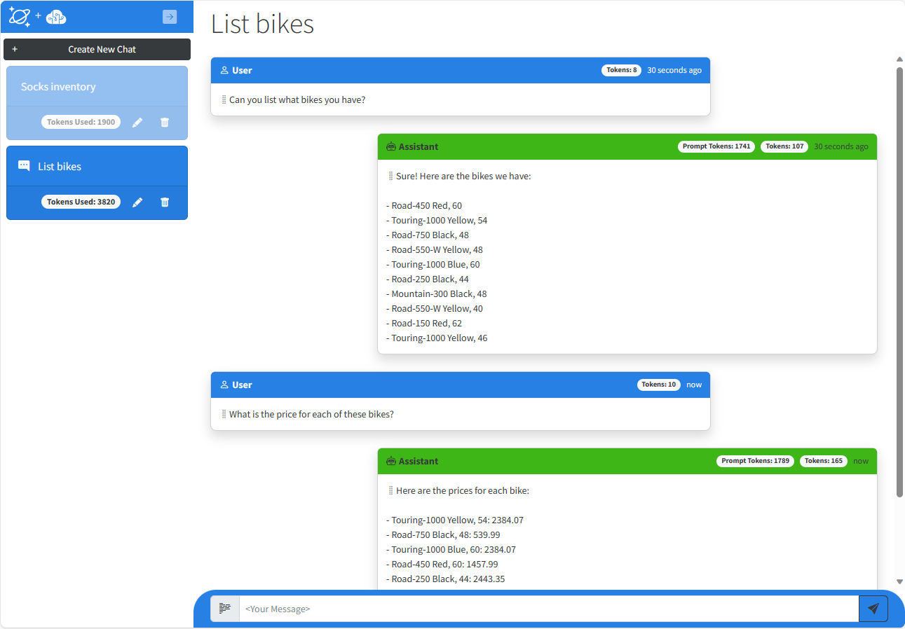

# Vector Search & AI Assistant for Azure Cosmos DB for MongoDB vCore

This solution demonstrates how to design and implement a **RAG Pattern** solution that incorporates Azure Cosmos DB for MongoDB vCore vector database capabilities with Azure OpenAI Service to build a vector search solution with an AI assistant user interface. The solution shows how to generate vectors on data stored in Azure Cosmos DB for MongoDB vCore using Azure OpenAI Service, then shows how to generate vectors from natural language user input which is then used in to perform a vector search using Azure Cosmos DB for MongoDB vCore. The vector query response payload is then passed to Azure OpenAI Service which generates responses back to the user. This solution includes additional key concepts such as managing conversational context and history, managing tokens consumed by Azure OpenAI Service, as well as understanding how to write prompts for large language models so they produce the desired responses.

The scenario for this sample centers around a consumer retail "Intelligent Agent" that allows users to ask questions on vectorized product, customer and sales order data stored in the database. The data in this solution is the [Cosmic Works](https://github.com/azurecosmosdb/cosmicworks) sample for Azure Cosmos DB. This data is an adapted subset of the Adventure Works 2017 dataset for a retail Bike Shop that sells bicycles, biking accessories, components and clothing.

## What is RAG?

RAG is an acronym for Retrieval Augmented Generation, a fancy term that essentially means retrieving additional data to provide to a large language model to use when generating a response (completion) to a user's natural language question (prompt). The data used in this type of application can be of any kind. However, there is a limit to how much data can be sent due to the limit of [tokens for each model](https://platform.openai.com/docs/models/overview) that can be consumed in a single request/response from Azure OpenAI Service. This solution will highlight these challenges and provide a simple example of how you can approach it.


## Solution User Experience

The application frontend is an ASP.NET Core Blazor Server application with a simple chatbot user interface:

The application includes a left-hand nav that contains individual chat sessions. In a normal retail environment, users would only be able to see their own session but we've included them all here. The chat session includes a count of all of the tokens consumed in each session. When the user types a question and hits enter the service vectorizes the user input then uses that in a vector query against the data stored in Azure Cosmos DB for MongoDB vCore. The results of the query are then passed to Azure OpenAI Service as part of the system prompt as well as some or all of the conversation history which is pre-prended to the user prompt. The generated response is then returned to the user. After the first question and response, the application calls a second "agent" which sends a request to the Azure OpenAI Service to summarize the topic of the conversation into a couple of words, then rename the chat session seen in the left-hand navigation. 

The chat session displays all of the tokens consumed for the length of that conversation. Each message in the chat also includes a token count. The `Prompt Tokens` are the tokens consumed by Azure OpenAI Service to process the request which includes some or all of the conversation history, the vector query payload and the user prompt. The `Tokens` represent the text for the User Prompt itself in the User message or the tokens used to generate the completion text in the Assistant message.

<p align="center">
    
</p>

## Solution Architecture

The solution architecture is represented by this diagram:
This solution is composed of the following services:

1.  Azure Cosmos DB for MongoDB vCore - Stores the operational retail data and their vectors in three collections: products, customers and salesorders. It also stores all of the chat history in the completions collection.
1.	Azure Functions - Hosts two HTTP triggers, `Ingest And Vectorize` imports and vectorizes data. A second HTTP trigger, `Add Remove Data` is used to add and remove a product from the product catalog to highlight how to add and remove data in real-time for an AI solution.
1.	Azure App Service - Hosts the chat web application.
1.	Azure OpenAI Service - Generates vectors using the Embeddings API on the `text-embedding-ada-002` model and chat completions using the Completion API on the `gpt-4-32k` model.


<p align="center">
    
</p>

## Overall solution workflow

There are four key elements of this solution, generating vectors, searching vectors, generating completions and storing conversations. Vectors are generated when data is inserted into each of the collections in Azure Cosmos DB for MongoDB vCore, then stored in a property called, `vector` that is used for vector searches. Users ask natural language questions using the web-based chat user interface. These prompts are vectorized and used to perform the vector search in a collection. The results are sent, along with some or all of the conversation history, to Azure OpenAI Service to generate a response back to the user. All of the User Prompts and Completions are stored in a collection along with the number of tokens consumed by each Prompt and Completion as well as the tokens used to process the completion. A Chat Session, contains all of the prompts and completions and a running total of all tokens consumed for that session.

## Generating vectors

Vectors are generated in two HTTP Triggers hosted in Azure Functions contained in the Vectorize project, [Ingest And Vectorize](https://github.com/Azure/Vector-Search-AI-Assistant-MongoDBvCore/blob/main/Vectorize/IngestAndVectorize.cs) and [Add Remove Data](https://github.com/Azure/Vector-Search-AI-Assistant-MongoDBvCore/blob/main/Vectorize/AddRemoveData.cs). `Ingest And Vectorize` imports the product, customer and sales order data from Azure Storage, then generates vectors on each item stores it in a collection that is configured with a vector index. The second HTTP trigger, `Add Remove Data` is used to add and vectorize a new product to the product catalog, making it available for searching in near real-time. The same trigger can be called again to remove that data to better simulate a real-world example.

You can see this at work by debugging Azure Functions remotely or running locally by setting a break point on [IngestDataFromBlobStorageAsync() function](https://github.com/Azure/Vector-Search-AI-Assistant-MongoDBvCore/blob/main/Vectorize/IngestAndVectorize.cs#L52).

This solution supports two vector types, IVF and HNSW. Users can configure which type to use in the configuration settings for the Search and the Vectorize projects.

## Searching vectors

The web-based front-end provides users the means for searching the retail bike data for this solution using vector queries. Vector queries are performed in the [MongoDbService](https://github.com/Azure/Vector-Search-AI-Assistant-MongoDBvCore/blob/main/SharedLib/Search/Services/MongoDbService.cs) in the SharedLib project. In the chat UX a user starts a new chat session then types in a natural language question. The text is sent to Azure OpenAI Service's embeddings API to generate vectors on it. The vectors are then used to perform a vector search on the collection selected in the chat web app in Azure Cosmos DB for MongoDB vCore. The query results are sent to Azure OpenAI Service, along with some of the conversation history and latest user question to generate a completion or response, which is then passed back to the user.

## Key concepts this solution highlights

Building a solution like this introduces a number of concepts that may be new to many developers looking to build these types of applications. This solution was developed to make it easy to follow the execution flow for a RAG Pattern application. It does this from a single function in the Chat Service called [GetChatCompletionAsync()](https://github.com/Azure/Vector-Search-AI-Assistant-MongoDBvCore/blob/main/Search/Services/ChatService.cs#L119). To best see this in action, set a breakpoint at the start of this function and step through each of the subsequent functions called to see each of the steps in action.

### Vectorizing the user prompt and conversation history

In a vector search solution, the filter predicate for any query is an array of vectors. This means that the text the user types in to the chat window, plus any conversational context that is gathered, must first be vectorized before the vector search can be done. This is accomplished in the [OpenAiService](https://github.com/Azure/VectorSearchAiAssistant/blob/main/SharedLib/Services/OpenAiService.cs) in the SharedLib project in the [GetEmbeddingsAsync()](https://github.com/Azure/Vector-Search-AI-Assistant-MongoDBvCore/blob/main/SharedLib/Services/OpenAiService.cs#L122) function. This function takes a string and returns an array of vectors, along with the number of tokens used to generate the vectors. This `promptTokens` value is stored with the user prompt and used to help manage conversation history.

### Doing the vector search

The vector search is the key function in this solution and is done against the Azure Cosmos DB for MongoDB vCore database in this solution. The function itself is rather simple and only takes and array of vectors with which to do the search. You can see the vector search at work by debugging the Azure Web App remotely or running locally. Set a break point on [VectorSearchAsync()](https://github.com/Azure/Vector-Search-AI-Assistant-MongoDBvCore/blob/main/Search/Services/MongoDbService.cs#L119), then step through each line to see how of the function calls to see the search and returned data.

### Managing conversational context and history

Large language models such as Chat GPT do not by themselves keep any history of what prompts your've sent it, or what completions it has generated. It is up to the developer to do this. Keeping this history is necessary or helpful for a few reasons. First, it allows users to ask follow up questions without having to provide any subsequent context, allowing for the user to have a conversation with the Intelligent Agent. Second, the conversation context is useful when performing vector searches as it can provide additional detail on what the user is looking for. As an example, if I asked our Intelligent Retail Agent "what bikes are available?", it would return for me all of the bikes in stock. If I then asked, "what colors are there?", if I did not pass the first prompt and completion, the vector search would not know that the user was asking about bike colors and would likely not produce an accurate or meaningful response. Lastly, the storing the chat history can be useful auditing purposes for customer interactions. Especially when trying to further improve the performance and quality of the vector search results and generated completions by Azure OpenAI.

The function that manages conversational history is called, [GetConversationHistory()](https://github.com/Azure/Vector-Search-AI-Assistant-MongoDBvCore/blob/main/Search/Services/ChatService.cs#L248). This function is used to gather the most recent conversation history up to the `_maxConversationTokens` limit, then returns it as a string separating each prompt and completion with a new line character. The new line is not necessary for ChatGPT, but makes it more readable for a user when debugging.

### Token management, (building the prompt)

One challenging aspect to building RAG Pattern solutions is managing the payload that gets sent to OpenAI. These LLMs operate using tokens as a compute currency. Every request has to stay within the maximum number of tokens that can be consumed in a single request (prompt) and response (completion). It's possible to build a prompt that consumes all of the tokens in the requests and leaves too few to produce a useful response. It's also possible to generate an exception from the Azure OpenAI Service if the request itself is over the token limit. We need a way to measure token usage before sending the request. This is handled in the [BuildPrompts()](https://github.com/Azure/Vector-Search-AI-Assistant-MongoDBvCore/blob/main/Search/Services/ChatService.cs#L172) function in the Chat Service.

In our function here we calculate the vectors on the data returned from our vector search, the conversation and the user prompt text. Then if necessary, we reduce the amount of tokens by reducing the vectors for the RAG data as well as the conversation. The user prompt we do not reduce because it is used to generate a meaningful response. Here is the flow of this function.

1. Measure the amount of tokens on the vector search results (rag tokens).
1. Measure the amount of tokens on the conversation (conv tokens).
1. Measure the amount of tokens for the user prompt (prompt tokens).
1. If the sum of all these tokens, plus some buffer is greater than `_maxCompletionTokens` then reduce the amount of conversation and rag data enough to get under the max amount we defined.
1. Finally, return the rag data payload and the conversation history + user prompt as two separate strings to send to Azure OpenAI Service.

One thing to call out here is how or what you do to manage this payload is completely up to you. In this example we reduced the size by doing the following calculations:

1. Calculate the amount of tokens that are over _maxCompletionTokens
1. Calculate the relative size for the rag data and the conversation as a percentage.
1. Calculate the new reduced number of tokens based upon a reduction against their relative size.
1. Reduce the vector payloads for both then decode back to text.


This function uses a third party nuget package called, [SharpToken](https://github.com/dmitry-brazhenko/SharpToken) which is a .NET wrapper around [OpenAI's tiktoken](https://github.com/openai/openai-cookbook/blob/main/examples/How_to_count_tokens_with_tiktoken.ipynb) which is an open source tokenizer. The utility takes text and generates an array of vectors. The number of elements in the array represent the number of tokens that will be consumed. It can also do the reverse and take an array of vectors and output text. 


### Generate the completion

Generating a chat completion from Azure OpenAI Service is done using one of its [GPT models](https://platform.openai.com/docs/guides/gpt). The Azure OpenAI Service takes in all of the data we've gathered up to this point, then generates a response or completion which the user will see. All of this happens in the [OpenAiService](https://github.com/Azure/Vector-Search-AI-Assistant-MongoDBvCore/blob/main/SharedLib/Services/OpenAiService.cs) in the [GetChatCompletionAsync()](https://github.com/Azure/Vector-Search-AI-Assistant-MongoDBvCore/blob/main/SharedLib/Services/OpenAiService.cs#L165) function.

This function takes the user prompt and the search results and builds a `System Prompt` with the search data, as well as a user prompt that includes the conversation history plus the users last question (prompt). The call is then made to the service which returns a `ChatCompletions` object which contains the response text itself, plus the number of tokens used in the request (prompt) and the number of tokens used to generate the response (completion).

One thing to note here is it is necessary to separate the number of tokens from the Prompt with the data versus the number of tokens from the text the user typed into the chat interface. This is necessary because we need an accurate way to estimate the number of tokens for *just the text* of the user prompt and not from the data.

### Saving the results

The last part is to save the results of both our user prompt and completion as well as the amount of tokens used. All of the conversational history and the amount of tokens used in each prompt and completion is stored in the completions collection in the Azure Cosmos DB for MongoDB vCore database in this solution. The call to the MongoDB vCore service is made by another function within our ChatService called, [AddPromptCompletionMessagesAsync()](https://github.com/Azure/Vector-Search-AI-Assistant-MongoDBvCore/blob/main/Search/Services/ChatService.cs#L290). This function creates two new [Message](https://github.com/Azure/Vector-Search-AI-Assistant-MongoDBvCore/blob/main/SharedLib/Models/Message.cs) objects and stores them in a local cache of all the Sessions and Messages for the application. It then adds up all of the tokens used and saves it to the Session object which keeps a running total for the entire [Session](https://github.com/Azure/Vector-Search-AI-Assistant-MongoDBvCore/blob/main/SharedLib/Models/Session.cs).

The data is then saved in the [UpdateSessionBatchAsync()](https://github.com/Azure/Vector-Search-AI-Assistant-MongoDBvCore/blob/main/SharedLib/Services/MongoDbService.cs#L257) function in the MongoDbService. This function creates a new transaction then updates the Session document and inserts two new Message documents into the completions collection.


## Getting Started

### Prerequisites

- Azure Subscription
- Subscription access to Azure OpenAI Service. Start here to [Request Access to Azure OpenAI Service](https://customervoice.microsoft.com/Pages/ResponsePage.aspx?id=v4j5cvGGr0GRqy180BHbR7en2Ais5pxKtso_Pz4b1_xUOFA5Qk1UWDRBMjg0WFhPMkIzTzhKQ1dWNyQlQCN0PWcu)

### Easy Installation

All connection information for Azure Cosmos DB and Azure OpenAI Service is zero-touch and injected as environment variables into Azure App Service and Azure Functions at deployment time. 

**Note:** You must have access to Azure OpenAI Service from your subscription before attempting to deploy this application.

[](https://portal.azure.com/#create/Microsoft.Template/uri/https%3A%2F%2Fraw.githubusercontent.com%2FAzure%2FVector-Search-Ai-Assistant-MongoDBvCore%2Fmain%2Fazuredeploy.json)

The provided ARM or Bicep Template will provision the following resources:
1. Azure Cosmos DB for MongoDB vCore. This stores retail data with HNSW vectors and the user prompts and completions from the chat application.
1. Azure App service. This will be configured to deploy the Search web application from **this** GitHub repository. This will work fine if no changes are made. If you want it to deploy from your forked repository, modify the Deploy To Azure button below.
1. Azure Open AI account with the `gpt-35-turbo` and `text-embedding-ada-002` models deployed.
1. Azure Functions. This will run on the same hosting plan as the Azure App Service.

**Note:** It will be necessary to increase the quota limits for both Azure OpenAI models once you have provisioned the services for this solution. You can increase these by going into Azure OpenAI studio to deployments and updating the transaction limits.

### Installation from Fork

1. Fork this repository to your own GitHub account.
1. Modify "appGitRepository" variable in the ARM or Bicep Template (depending on which you use to deploy) to point to your fork of this repository: https://github.com/MyGitHubAccount/Vector-Search-AI-Assistant-MongoDBvCore.git
1. If using the Deploy to Azure button above, modify this README.md file to change the path for the Deploy To Azure button to your local repository.
1. If you deploy the application first, then fork it, you can go to the Deployment Center in Azure Portal for the Azure Web Apps and Functions and update the repository by disconnecting and connecting an external git repository pointing to your fork.


### Initial data load

The data for this solution must be loaded and vectorized once it has been deployed. This process takes approximately 5-10 minutes to complete. Follow the steps below.

1. Open a browser so you can watch Azure Functions processing the data by navigating to each of the Azure Functions in the portal by navigating to the Log stream tab in the Monitoring section on the left hand side of the page. **Note:** you will need to enable Application Insights for the Azure Functions in the portal when first accessing the Functions Logs. 
1. To start the data load and vector generation, open a new browser tab, in the address bar type in `{your-app-name}-function.azurewebsites.net/api/ingestandvectorize`


<p align="center">
    
</p>

### Running the solution

1. After data loading is complete, you can open the Chat Web Application and run the app.
1. Open a new browser and type in the address bar `{your-app-name}-web.azurewebsites.net` You can also open the Azure Portal, go to the resource group for your deployment, open the Azure App Service. Then on the Overview tab, click the link to launch the website.
1. Once the web application loads, click [+ Create New Chat] button to create a new chat session.
1. Select a collection to use for your RAG Pattern vector query (Products, Customers, Sales Orders)
1. Type in your questions in the text box and press Enter.

Here are some sample questions you can ask:

- What kind of bikes do you have?
- Can you share more details on your touring bikes?
- What colors do your touring bikes come in?

Feel free to explore and ask anything.

### Real-time add and remove data

One great reason about using an operational database like Azure Cosmos DB for MongoDB vCore as your source for data to be vectorized and search is that you can dynamically add and remove data to be vectorized and immediately available for search. The steps below can demonstrate this capability.

#### Steps to demo adding and removing data from vector search

1. Start a new Chat Session in the web application.
1. In the chat text box, type: "Can you list all of your socks?". The AI Assistant will list 4 different socks of 2 types, racing and mountain.
1. Open a new browser tab, in the address bar type in `{your-app-name}-function.azurewebsites.net/api/addremovedata?action=add` replace the text in curly braces with your application name, then press enter.
1. The browser should show that the HTTP Trigger executed successfully.
1. Return to the AI Assistant and type, ""Can you list all of your socks again?". This time you should see a new product, "Cosmic Socks, M"
1. Return to the second browser tab and type in, `{your-app-name}-function.azurewebsites.net/api/addremovedata?action=remove` replace the text in curly braces with your application name, then press enter.
1. Open a **new** chat session and ask the same question again. This time it should show the original list of socks in the product catalog. 

**Note:** Using the same chat session after adding them will sometimes result in the Cosmic Socks not being returned. If that happens, start a new chat session and ask the same question. Also, sometimes after removing the socks they will continue to be returned by the AI Assistant. If that occurs, also start a new chat session. The reason this occurs is that previous prompts and completions are sent to OpenAI to allow it to maintain conversational context. Because of this, it will sometimes use previous completions as data to make future ones.

<p align="center">
    
</p>

## Clean-up

Delete the resource group to delete all deployed resources.


## Run locally and debug

This solution can be run locally post deployment. Below are the prerequisites and steps.

### Prerequisites for running/debugging locally

- Visual Studio, VS Code, or some editor if you want to edit or view the source for this sample.
- .NET 7 SDK
- Azure Functions SDK v4
- Azurite, for debugging using Azure Functions local storage.

### Local steps

#### Search Azure App Service
- In Azure Portal, open the Configuration for the Azure App Service, click Show Values and keep open.
- Within Visual Studio, right click the Search project, create a new file, `appsettings.Development.json`.
- Copy the contents of the JSON below.
- Copy the missing connection information from the Configuration values in Azure Portal.

```json
{
  "DetailedErrors": true,
  "Logging": {
    "LogLevel": {
      "Default": "Information",
      "Microsoft.AspNetCore": "Warning"
    }
  },
  "AllowedHosts": "*",
  "OpenAi": {
    "Endpoint": "",
    "Key": "",
    "EmbeddingsDeployment": "",
    "CompletionsDeployment": "",
    "MaxConversationTokens": "1000",
    "MaxCompletionTokens": "2000",
    "MaxEmbeddingTokens": "8000"
  },
  "MongoDb": {
    "Connection": "",
    "DatabaseName": "retaildb",
    "CollectionNames": "products, customers, salesOrders, completions",
    "MaxVectorSearchResults": "10",
    "VectorIndexType": "hnsw" // ivf, hnsw
  }
}
```
 

#### Vectorize Azure Function
- Open the Configuration for the Azure Function, click Show Values and keep open copy.
- Within Visual Studio, right click the Vectorize project, create a new file called, `local.settings.json`
- Copy the contents of the JSON below
- Copy the missing connection strings and keys from the Configuration values in Azure Portal.

```json
{
  "Values": {
    "AzureWebJobsStorage": "UseDevelopmentStorage=true",
    "FUNCTIONS_WORKER_RUNTIME": "dotnet-isolated",
    "OpenAi__Endpoint": "",
    "OpenAi__Key": "",
    "OpenAI__CompletionsDeployment": "",
    "OpenAi__EmbeddingsDeployment": "",
    "OpenAi__MaxConversationTokens": "1000",
    "OpenAi__MaxCompletionTokens": "4000",
    "OpenAi__MaxEmbeddingTokens": "8000",
    "MongoDb__Connection": "",
    "MongoDb__DatabaseName": "retaildb",
    "MongoDb__CollectionNames": "products, customers, salesOrders, completions",
    "MongoDb__MaxVectorSearchResults": "10",
    "MongoDb__VectorIndexType": "hnsw" // ivf, hnsw
  },
  "IsEncrypted": false
}
```

### Run it!
If running in Visual Studio, configure both the Search and Vectorize projects to start. Place breakpoints where you'd like to step through the source. Press F5 to start them in a debugger.


That's it!!! I hope you enjoy this solution

## Resources

- [Vector search with data in Azure Cosmos DB](https://learn.microsoft.com/azure/cosmos-db/vector-search)
- [OpenAI Platform documentation](https://platform.openai.com/docs/introduction/overview)
- [Azure OpenAI Service documentation](https://learn.microsoft.com/azure/cognitive-services/openai/)
- [Azure Cosmos DB Free Trial](https://aka.ms/TryCosmos)
